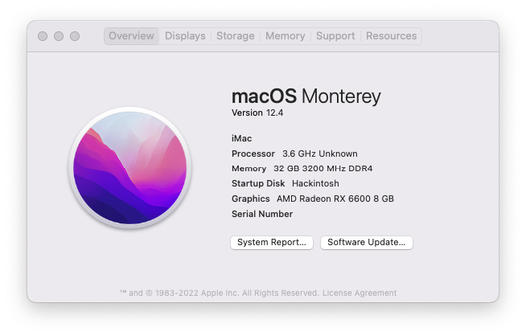
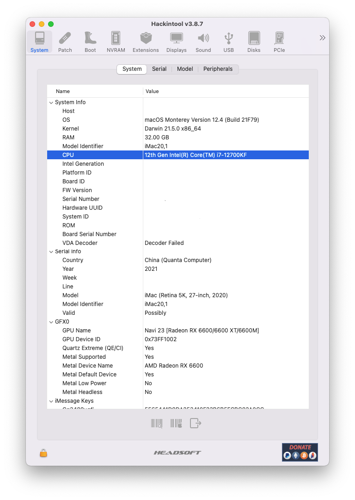
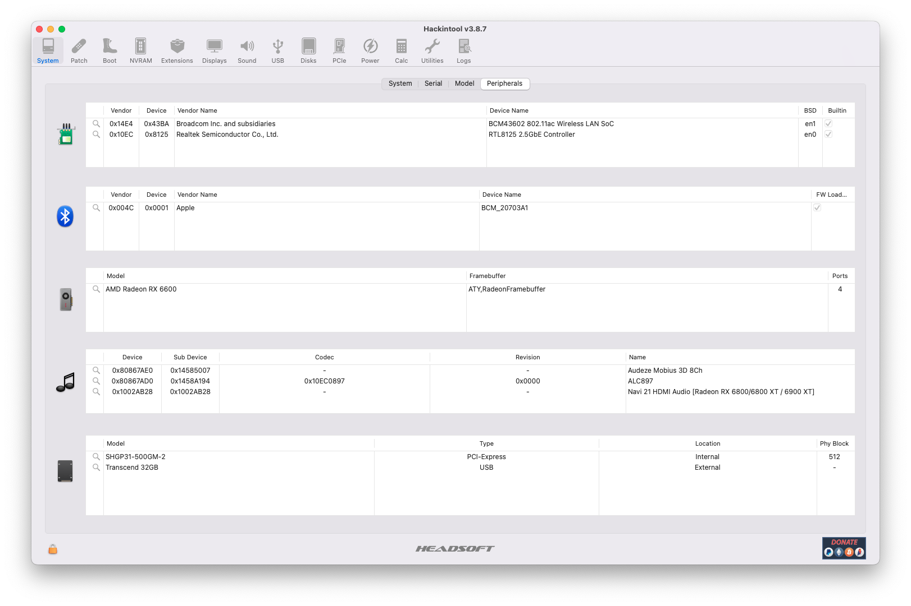
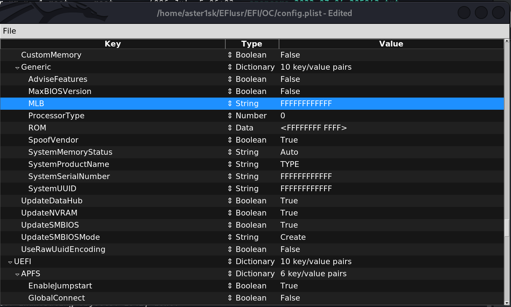

## AlderLake-B660M-Opencore-Hackintosh
***

***
- It has been tested on 
  - Intel i7-12700KF
  - GIGABYTE B660M GAMING D4
  - Samsung DDR4 3200 32GB 
  - Hynix Gold P31 
  - SAPPHIRE RX6600
  - BCM943602CS

### Precautions for use
***

- PlatformInfo (MLB, ROM, SystemProductName, System Serial Number, SystemUUID) has been modified to FFFF.., so please modify it and use it.

